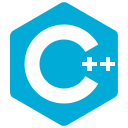

<!-- 

 -->

<h1 align="center">
⚜️ Hello, weary traveller! ⚜️
</h1>

Data Engineer at Yandex. Former chemist and ML engineer. Future backend developer. Always learning and staying chill. Hobbyist musician, artist, D&D and tea enjoyer.

## :briefcase: Work experience

- [ ] *Feb 24 - now:* Data Engineer at Yandex
- [x] *Nov 23 - Feb 24:* Backend developer (C++) at Yandex ([Deep Dive](https://yandex.ru/yaintern/deep_dive))
- [x] *Oct 22 - Nov 23:* Engineer of Machine Learning at ITMO University ([NCCT](https://en.itmo.ru/en/department/480/National_Center_for_Cognitive_Technologies.htm))

## :mortar_board: Education

- [ ] *Sep 23 - now:* Study at [Tinkoff Backend Academy](https://fintech.tinkoff.ru/academy/backend/)
- [x] *Sep 22 - now:* Master's Degree at [ITMO](https://en.itmo.ru/) (Big Data & Machine Learning)
- [x] *Sep 18 - Jun 22:* Bachelor's Degree at [SPbU](https://spbu.ru/) (Chemistry)

## :computer: Hard skills

&nbsp;
&nbsp;
&nbsp;
&nbsp;
&nbsp;
&nbsp;
&nbsp;
&nbsp;
&nbsp;
&nbsp;

<!-- 00acd7ff -->

## :speaking_head: Soft skills

- :chart_with_upwards_trend: Project presentation
- :microphone: Public speaking
- :pencil: Scientific writing

## :globe_with_meridians: Natural languages

- :ru: Russian (native)
- :uk: English (C1, [IELTS](https://drive.google.com/file/d/1h1CtJ94Yk2MFjWrm8z4qKwNl8ByBuqkJ/view?usp=sharing))
- :de: German (B2/C1, [TestDaF](https://drive.google.com/file/d/1v0tc5AU1laLYTVCUiT1MKzjp7nLxUjmr/view?usp=sharing))
- :cn: Chinese (~HSK1)

## :video_game: Hobbies

- :paintbrush: Visual arts: drawing, cartography, calligraphy, 3D
- :guitar: Writing music: production, bass, guitar and vocals
- :game_die: Dungeons & Dragons (homebrew everything)
- :tea: Gongfu tea

## :microscope: Publications

- [Gladnev, S.V.; Grigoryev, M.V.; Kryukova, M.A.; Khairullina, E.M.; Tumkin, I.I.; Bogachev, N.A.; Mereshchenko, A.S.; Skripkin, M.Y. Structures, Bonding and Sensor Properties of Some Alkaline o-Phthalatocuprates. Materials 2021, 14, 5548.](https://doi.org/10.3390/ma14195548)
- [Zenkevich, I.G.; Byvsheva, S.V.; Gerasimov, A.I.; Gladnev, S.V.; Grigoriev, M.V. et. al. Decreasing the uncertainty of gas chromatographic quantification using the solvent’s signal in the method of external standard. Analitika i kontrol’ [Analytics and Control], 2022, vol. 26, no. 2, pp. 141-149.](http://dx.doi.org/10.15826/analitika.2022.26.2.005)
- [Semenov, V.; Grigoriev, M.; Kirsanov, D.; Panchuk, V. When one equals two: Chemometrics turns Mössbauer spectrometer into X-ray fluorescence one. Spectrochimica Acta Part B: Atomic Spectroscopy, 2024, vol. 213, p. 106878.](https://doi.org/10.1016/j.sab.2024.106878)

## :bar_chart: GitHub stats

